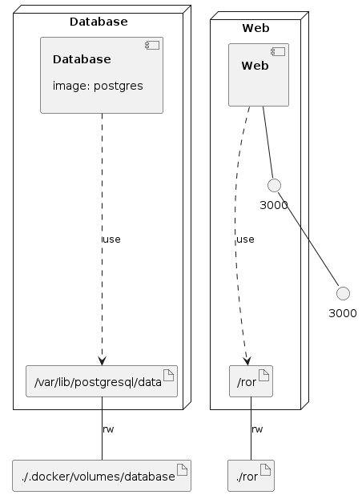

# Docker Compose: Ruby on Rails Example

A simple example of using Docker Compose for developing and deploying
Ruby on Rails applications.

Read the full article on [jigarius.com](https://jigarius.com/blog/ruby-on-rails-with-docker-compose).

## Getting started

Follow the steps mentioned under _existing app_ or _new app_ depending on your
situation. That will ensure that the `ror` directory is in order. After that,
follow these steps:

  * Destroy any existing containers with conflicting names.
  * Copy `.env.example` to `.env` and modify (if required).
  * Create `config/database.yml` based on `.docker/ror/example.database.yml`.
  * Build an image for Ruby on Rails:
    ```
    docker-compose build
    ```
  * Boot up the app by running:
    ```
    docker-compose up
    ```
  * Create databases by running:
    ```
      docker-compose exec web rake db:create
    ```

Cool! Now your Rails app should be available at
[localhost:3000](http://localhost:3000).

### Existing app

  * Delete the contents of the `ror` directory.
  * Put the files of your existing Rails app in the `ror` directory.
    * The `Gemfile` should be at `ror/Gemfile`.

### New app

If you want to start with a Rails app from scratch,

  * Create the following files:
    * `Gemfile`: You can base this on `.docker/ror/example.Gemfile`.
    * `Gemfile.lock`: An empty file.
  * Run the following command to install Rails. You can modify the params for
    the `rails new` command as needed.
    ```
    docker-compose run --no-deps web rails new . --force --database=postgresql
    ```
    * For a quick Rails install, use the `--minimal` flag.

## Commands

Here are some helpful commands.

  * `docker-compose start`: Starts app containers.
  * `docker-compose stop`: Stops app containers.
  * `rake -T`: For some other helpful commands.

See [docker compose docs](https://docs.docker.com/compose/) for further info on
Docker Compose.


### Infrastructure model

